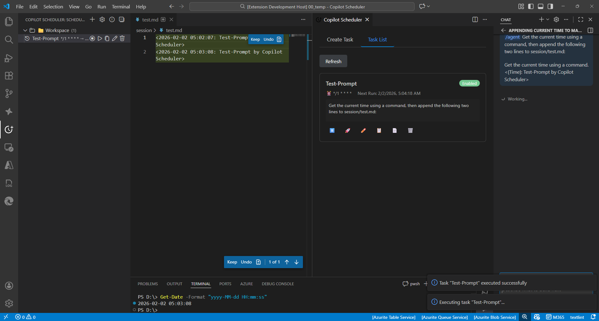

# Copilot Scheduler (Local Fork)

## Local Fork Guide

This repository is the maintained private fork used in the HBG workspace. It is intentionally separated from the upstream marketplace extension and is packaged as `local-dev.copilot-scheduler-local` on the `99.0.x` version line so it does not collide with upstream installs.

### What This Fork Adds

- Strict per-repo workspace scheduling. Each repo keeps its own schedule in its own `.vscode` folder.
- A repo-local `Jobs` board for workflows built in columns of chained tasks, with folders, pause/resume, dedicated pause checkpoints, compile-to-task/Bundled Jobs flow, drag-drop ordering, per-step time windows, drag-drop moves between folders, and a clearer current-folder indicator.
- A repo-local `Research` tab for bounded benchmark-driven iteration against an allowlisted file set.
- Embedded MCP server support bundled with the extension.
- Prompted MCP setup that can create or merge `.vscode/mcp.json` for the current repo.
- Hybrid task storage, where workspace tasks live in repo files and global tasks remain in extension storage.
- Repo-local schedule backup history with the last 100 changes stored under `.vscode/scheduler-history`.
- Repo-scoped auto-open on startup.
- Optional new-chat-session execution mode for scheduled runs.
- Task-level agent/model selection that now runs in an isolated chat context when needed instead of silently reusing the currently active chat state.
- A one-click skill inserter in the Create/Edit form that appends a skill instruction sentence into the prompt.
- Startup review for overdue tasks instead of silent catch-up execution.
- A more compact task list and larger countdown units.
- An in-app `How To Use` tab inside the scheduler UI.

### Installation

This fork is packaged as a normal VSIX and is intended to install on Windows, macOS, and Linux.

1. Build the VSIX with `npm run package:vsix`.
2. Install it with one of these cross-platform scripts:
  `npm run install:vsix`
  `npm run install:vsix:insiders`
  `npm run install:vsix:both`
3. If the VS Code shell command is not available on the machine, use `Extensions: Install from VSIX...` inside VS Code or VS Code Insiders and select the generated VSIX manually.
4. Reload VS Code.
5. Disable or uninstall `yamapan.copilot-scheduler` if it is installed, so this fork remains the active implementation.

Notes:

- The `code` and `code-insiders` shell commands use the same names on Windows, macOS, and Linux, but they must be installed on the local machine first.
- `npm run compile` now builds both the extension bundle and the embedded MCP server bundle.

### Basic Workflow

1. Open the scheduler from the activity bar, from `Copilot Scheduler: Create Scheduled Prompt (GUI)`, or from the activation notification's `Open Scheduler` button.
2. Start in the `How To Use` tab, which now opens first and includes the current Jobs flow, the Research tab guidance, and the MCP setup button.
3. Create tasks in the `Create Task` tab by choosing the task name, prompt source, cron schedule, scope, labels, optional agent/model, and optional skill insertion.
4. Manage tasks in the `Task List` tab: run, edit, duplicate, copy, enable, disable, delete, move tasks, and filter by effective labels.
5. Build chained workflows in the `Jobs` tab by creating folders, dragging jobs into folders, duplicating jobs, inserting pause checkpoints, pausing jobs, attaching existing tasks, creating inline steps, or compiling a whole job into one task and moving the source job into `Bundled Jobs`.
6. Use the `Research` tab to define a benchmark command, metric regex, bounded run budget, and allowlisted editable paths for controlled iteration.
7. Use the toolbar in the `Task List` tab to refresh data, toggle repo-scoped startup auto-open, and restore older repo-local schedule backups.

### Prompt Sources

- Inline text stored directly in the task.
- Local templates from `.github/prompts/*.md` in the current repo.
- Global templates from the VS Code prompts folder or the configured global prompts path.
- Skill references can be inserted into the prompt with one click from discovered workspace/global skill markdown files such as `SKILL.md`.

### Jobs Board

- Jobs are repo-local workflows stored next to the workspace scheduler files.
- A job owns one cron schedule and an ordered list of workflow items, so you can build it as columns of chained tasks with dedicated pause checkpoints between segments.
- Jobs can be dragged from the Jobs list into sidebar folders, including back to `All jobs`.
- The sidebar now shows the current folder explicitly and highlights the active folder more clearly.
- Each step has a default 30-minute window that can be edited per node.
- Drag-drop reordering updates the workflow timeline and the derived next-run order.
- Dedicated pause checkpoints block all downstream steps until you approve the previous result. Rejecting a waiting pause opens the previous task in the editor so it can be changed.
- `Compile To Task` merges the full workflow into one combined prompt task, then moves the source job into the `Bundled Jobs` folder in an inactive state so it can still be edited or duplicated later.
- Deleting a step from Jobs now confirms first and removes the underlying task from both the workflow and the Task List.
- Pausing a job suppresses all child-task executions without changing each task's own enabled flag.
- Effective labels combine manual task labels with the owning job name, so the Task List can be filtered by workflow.

### Research Tab

- Research profiles are stored repo-locally in `.vscode/research.json` with run history under `.vscode/research-history`.
- Each profile defines the benchmark command, a numeric metric regex, whether to maximize or minimize it, a run budget, and an allowlisted set of editable files.
- Runs are bounded by max iterations, max minutes, benchmark timeout, and max consecutive failures.
- The UI keeps recent runs, attempt outcomes, scores, changed files, and benchmark output so you can decide whether to keep or reject a result.
- This is intentionally a bounded benchmark-command researcher, not an unrestricted autonomous code editor.

### Repo Storage Model

- Workspace tasks are stored in `.vscode/scheduler.json` and `.vscode/scheduler.private.json` inside the repo that is actually open in VS Code.
- The last 100 workspace schedule changes are stored in `.vscode/scheduler-history` so you can restore an older repo-local version from the UI.
- Nested repos no longer inherit tasks from a parent folder.
- Global tasks still exist in extension storage, but repo schedules are authoritative in the repo's `.vscode` files.

### Session Behavior

The global setting `copilotScheduler.chatSession` still provides the default scheduler behavior, and recurring tasks can now override it directly in the Create/Edit UI.

- Recurring tasks can choose `continue` or `new` per task.
- One-time tasks do not store a task-level chat session mode.
- `continue` keeps using the currently active Copilot chat flow.
- `new` tries to open a new Copilot chat session before sending the scheduled prompt.
- Use `new` with absolute care. One scheduled AI run can intentionally open another AI session, which means an AI-driven chain can continue further than a single message.
- VS Code does not currently expose a supported extension API to reopen a specific old Copilot conversation by saved session ID, so this fork can persist the recurring task mode but cannot force-restore an exact prior Copilot thread.
- MCP is a different launch path, but it can still trigger new sessions indirectly. Once the scheduler MCP tools are exposed to Copilot, a model can create, modify, or run tasks that use `new` chat-session mode, so one LLM can open another.

### Agent and Model Selection

- If a task specifies a dedicated agent or model, the extension now prefers a fresh Copilot chat context so that it does not silently reuse the currently active chat state.
- If VS Code cannot honor a task-specific model in the fallback chat path, the run fails explicitly instead of pretending the active model was used correctly.
- The Test Run path uses the same executor behavior as scheduled and manual runs.

### Skill Insertion

- The Create/Edit form includes a skill dropdown plus `Insert Skill` button.
- Choosing a skill inserts a sentence such as `Use path/to/SKILL.md to know how things must be done.` into the prompt.
- Inserting a skill switches the prompt to inline mode so the added instruction is preserved even if you started from a template.

Example:

```json
{
  "copilotScheduler.chatSession": "new"
}
```

### Overdue Tasks

If VS Code was closed and tasks became overdue:

- Recurring tasks are reviewed one by one on startup and can either run now or wait for the next cycle.
- One-time tasks are reviewed one by one on startup and can either run now or be rescheduled by choosing how many minutes from now they should run.
- Remaining overdue tasks are not silently auto-executed after you dismiss the review.

### Auto-Open On Startup

The setting `copilotScheduler.autoShowOnStartup` is repo-scoped.

- Turn it on in `.vscode/settings.json` for repos where you want the scheduler to open automatically.
- Or toggle it directly from the `Task List` toolbar inside the scheduler UI.

Example:

```json
{
  "copilotScheduler.autoShowOnStartup": true
}
```

### MCP Status

Yes, MCP is set up in the plugin itself.

- The extension includes an embedded MCP server implemented in `src/server.ts` and packaged as `out/server.js`.
- Treat MCP exposure as high risk. Once Copilot can see these tools, it can inspect scheduler state, modify saved tasks, and trigger runs that may open additional AI sessions.
- `scheduler_list_tasks` and `scheduler_get_task` inspect current scheduler state and single saved tasks.
- `scheduler_add_task`, `scheduler_update_task`, `scheduler_duplicate_task`, `scheduler_remove_task`, and `scheduler_toggle_task` create or change saved tasks.
- `scheduler_run_task` triggers a task, while `scheduler_list_history`, `scheduler_restore_snapshot`, and `scheduler_get_overdue_tasks` inspect recovery state and due work.
- Installing the extension does not register scheduler MCP tools globally. A workspace still needs an MCP launcher entry such as `.vscode/mcp.json` that starts the installed scheduler server.
- In short: the server is bundled with the plugin, but the workspace still decides how to launch it.

### MCP Setup

Use the built-in `Set Up MCP` action from the How To tab or the `Copilot Scheduler: Set Up Workspace MCP` command if you want Copilot Chat to see the scheduler MCP tools.

What the setup flow does:

- Creates `.vscode/mcp.json` if it does not exist.
- Merges the `scheduler` server entry into an existing `.vscode/mcp.json` without deleting unrelated MCP servers.
- Writes the correct `out/server.js` path for the currently installed extension.
- Reports invalid JSON instead of overwriting it blindly.

Manual example for reference:

Development checkout example:

```json
{
  "servers": {
    "scheduler": {
      "type": "stdio",
      "command": "node",
      "args": [
        "F:/HBG Webserver/extensions/source-scheduler/out/server.js"
      ]
    }
  }
}
```

Installed VSIX example:

```json
{
  "servers": {
    "scheduler": {
      "type": "stdio",
      "command": "node",
      "args": [
        "<absolute path to your installed extension>/out/server.js"
      ]
    }
  }
}
```

Notes:

- The automatic setup flow writes the same structure into `.vscode/mcp.json` in the repo where you want the scheduler MCP tools available.
- On stable VS Code installs, the extension usually lives under `~/.vscode/extensions` on macOS/Linux or `%USERPROFILE%/.vscode/extensions` on Windows.
- On VS Code Insiders, use the `.vscode-insiders/extensions` install root instead.
- Replace the versioned extension folder name with the exact installed version of `local-dev.copilot-scheduler-local`.
- Reload the window after adding or changing `.vscode/mcp.json`.

### Cross-Platform Readiness

- The packaged VSIX is platform-neutral and the extension/runtime code already resolves paths for Windows, macOS, and Linux where needed.
- The new package/install scripts are platform-neutral Node scripts, so you do not need PowerShell-specific commands just to build or install the extension.
- The remaining limitation is validation coverage: this repository is being edited from Windows, so Linux/macOS installation was made ready in code and docs here, but actual runtime still needs to be exercised on those operating systems to fully certify them.

### Key Differences From Upstream

- Extension identity: `local-dev.copilot-scheduler-local`
- Private repo and local VSIX packaging flow
- Embedded MCP server
- Repo-local `.vscode` schedule files
- Strict per-repo workspace isolation
- Repo-scoped startup auto-open
- Startup overdue-task review and one-time rescheduling
- Compact task list with larger countdown units
- Windows test-host workaround for paths with spaces

## Original Upstream README

The original upstream README is preserved below for reference.

---

## ⏰ Copilot Scheduler

[](https://marketplace.visualstudio.com/items?itemName=yamapan.copilot-scheduler)
[](https://marketplace.visualstudio.com/items?itemName=yamapan.copilot-scheduler)
[](LICENSE)
[](https://github.com/aktsmm/vscode-copilot-scheduler)
[](https://github.com/aktsmm/vscode-copilot-scheduler)

Schedule automatic AI prompts with cron expressions in VS Code.

[**📥 Install from VS Code Marketplace**](https://marketplace.visualstudio.com/items?itemName=yamapan.copilot-scheduler)

[Japanese / 日本語版はこちら](README_ja.md)

## 🎬 Demo



## ✨ Features

🗓️ **Cron Scheduling** - Schedule prompts to run at specific times using cron expressions

🤖 **Agent & Model Selection** - Choose from built-in agents (@workspace, @terminal) and AI models (GPT-4o, Claude Sonnet 4)

🌐 **Multi-language Support** - English and Japanese UI with auto-detection

📊 **Sidebar TreeView** - Manage all your scheduled tasks from the sidebar

🖥️ **Webview GUI** - Easy-to-use graphical interface for creating and editing tasks

## ⏰ Cron Expression Examples

| Expression     | Description             |
| -------------- | ----------------------- |
| `0 9 * * 1-5`  | Weekdays at 9:00 AM     |
| `0 18 * * 1-5` | Weekdays at 6:00 PM     |
| `0 9 * * *`    | Every day at 9:00 AM    |
| `0 9 * * 1`    | Every Monday at 9:00 AM |
| `*/30 * * * *` | Every 30 minutes        |
| `0 * * * *`    | Every hour              |

## 📋 Commands

| Command                                             | Description                |
| --------------------------------------------------- | -------------------------- |
| `Copilot Scheduler: Create Scheduled Prompt`        | Create a new task (CLI)    |
| `Copilot Scheduler: Create Scheduled Prompt (GUI)`  | Create a new task (GUI)    |
| `Copilot Scheduler: List Scheduled Tasks`           | View all tasks             |
| `Copilot Scheduler: Edit Task`                      | Edit an existing task      |
| `Copilot Scheduler: Delete Task`                    | Delete a task              |
| `Copilot Scheduler: Toggle Task (Enable/Disable)`   | Enable/disable a task      |
| `Copilot Scheduler: Enable Task`                    | Enable a task              |
| `Copilot Scheduler: Disable Task`                   | Disable a task             |
| `Copilot Scheduler: Run Now`                        | Execute a task immediately |
| `Copilot Scheduler: Copy Prompt to Clipboard`       | Copy prompt to clipboard   |
| `Copilot Scheduler: Duplicate Task`                 | Duplicate a task           |
| `Copilot Scheduler: Move Task to Current Workspace` | Move a workspace task here |
| `Copilot Scheduler: Open Settings`                  | Open extension settings    |
| `Copilot Scheduler: Show Version`                   | Show extension version     |

## ⚙️ Settings

| Setting                                   | Default     | Description                                                                                             |
| ----------------------------------------- | ----------- | ------------------------------------------------------------------------------------------------------- |
| `copilotScheduler.enabled`                | `true`      | Enable/disable scheduled execution                                                                      |
| `copilotScheduler.showNotifications`      | `true`      | Show notifications when tasks are executed                                                              |
| `copilotScheduler.notificationMode`       | `sound`     | Notification mode (sound/silentToast/silentStatus)                                                      |
| `copilotScheduler.logLevel`               | `info`      | Log level (none/error/info/debug)                                                                       |
| `copilotScheduler.language`               | `auto`      | UI language (auto/en/ja)                                                                                |
| `copilotScheduler.timezone`               | `""`        | Timezone for scheduling                                                                                 |
| `copilotScheduler.chatSession`            | `new`       | Chat session (new/continue)                                                                             |
| `copilotScheduler.defaultScope`           | `workspace` | Default scope                                                                                           |
| `copilotScheduler.globalPromptsPath`      | `""`        | Custom global prompts folder path (default: VS Code user prompts folder)                                |
| `copilotScheduler.globalAgentsPath`       | `""`        | Custom global agents folder path                                                                        |
| `copilotScheduler.jitterSeconds`          | `600`       | Max random delay (seconds) before execution (0–1800, 0 = off). Each task can override it.               |
| `copilotScheduler.maxDailyExecutions`     | `24`        | Daily execution limit across all tasks (0 = unlimited, 1–100). ⚠️ Unlimited may risk API rate-limiting. |
| `copilotScheduler.minimumIntervalWarning` | `true`      | Warn when cron interval is shorter than 30 minutes                                                      |

## 📝 Prompt Placeholders

Use these placeholders in your prompts:

| Placeholder     | Description           |
| --------------- | --------------------- |
| `{{date}}`      | Current date          |
| `{{time}}`      | Current time          |
| `{{datetime}}`  | Current date and time |
| `{{workspace}}` | Workspace name        |
| `{{file}}`      | Current file name     |
| `{{filepath}}`  | Current file path     |

## 📂 Task Scope

- **Global**: Task runs in all workspaces
- **Workspace**: Task runs only in the specific workspace where it was created

## 📄 Prompt Templates

Store prompt templates for reuse:

- **Local**: `.github/prompts/*.md` in your workspace
- **Global**: VS Code user prompts folder (or the folder set in `copilotScheduler.globalPromptsPath`)

## 📋 Requirements

- VS Code 1.80.0 or higher
- GitHub Copilot extension

## ⚠️ Known Issues

- Copilot Chat API is still evolving; some features may require updates as the API stabilizes
- Model selection may not work in all configurations

**Disclaimer:** This extension automates Copilot Chat. GitHub's [Acceptable Use Policies](https://docs.github.com/en/site-policy/acceptable-use-policies/github-acceptable-use-policies#4-spam-and-inauthentic-activity-on-github) prohibit "excessive automated bulk activity", the [Terms of Service § H (API Terms)](https://docs.github.com/en/site-policy/github-terms/github-terms-of-service#h-api-terms) allow account suspension for excessive API usage, and the [GitHub Copilot Additional Product Terms](https://docs.github.com/en/site-policy/github-terms/github-terms-for-additional-products-and-features#github-copilot) apply these policies directly to Copilot. Use at your own risk; your account could be rate-limited or restricted. Configure jitter/daily limits/longer intervals to reduce risk, but there is no guarantee.

Note: There are [reports](https://github.com/orgs/community/discussions/160013) of Copilot access being restricted even without using automation tools. These mitigations reduce obvious automation patterns but cannot eliminate that risk.

🐛 [Report a bug](https://github.com/aktsmm/vscode-copilot-scheduler/issues)

## 📦 Release Notes

### 0.1.0

Initial release:

- Cron-based task scheduling
- Agent and model selection
- English/Japanese localization
- Sidebar TreeView
- Webview GUI for task management
- Prompt template support

## 📄 License

[CC-BY-NC-SA-4.0](LICENSE) © [aktsmm](https://github.com/aktsmm)

---

**Enjoy scheduling your Copilot prompts!** 🚀
