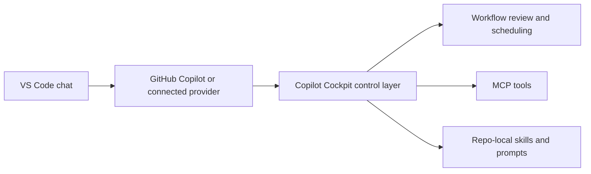

<!-- markdownlint-disable MD033 MD041 -->
<p align="center">
    
</p>
<h1 align="center">Copilot Cockpit</h1>

<p align="center">
    <a href="https://github.com/goodguy1963/Copilot-Cockpit/actions/workflows/release.yml">
        
    </a>
    <a href="https://github.com/goodguy1963/Copilot-Cockpit/releases/latest">
        
    </a>
    <a href="https://github.com/goodguy1963/Copilot-Cockpit/releases/tag/edge">
        
    </a>
    <a href="https://marketplace.visualstudio.com/items?itemName=goodguy1963.copilot-cockpit">
        
    </a>
</p>

<!-- markdownlint-enable MD033 MD041 -->

Copilot Cockpit the workflow system for AI work in VS Code: planning and triage, execution and scheduling, and optional (but recommended) MCP and agent team integration.

## Why It Exists

I built it because most AI coding workflows still feel like chaotic chat sessions. They generate output, but they don’t give solo builders much structure or control.  
It connects three tightly linked layers:

1. Planning and triage in `Todo Cockpit`
2. Execution, scheduling, and performance improvement through `Tasks`, `Jobs`, and `Research`
3. Tool and control-plane integration through `MCP` and optional agent surfaces

The workflow is explicit on purpose. A `Todo` is the planning artifact — flag it **needs bot review** to trigger a focused investigation that returns findings as a comment. A `Task` is one executable unit. A `Job` is an orchestrated or scheduled run built from steps. `Research` is the performance and benchmarking workspace for iterative AI-driven improvement.

That structure keeps the LLM as the native execution chat surface while Copilot Cockpit provides the approval, scheduling, and control layer around it. The goal is not less automation. The goal is accountable automation that can move from intake to execution without losing review, context, or ownership.

**The AI control layer for GitHub Copilot — a persistent AI workflow cockpit inside VS Code with planning, review gates, and an agent crew for the heavy lifting.**

## 🎬 Demo

[](https://youtu.be/G2WcWtc0_70)

- **[🚀 Fast demo](https://youtu.be/G2WcWtc0_70)** — a quick overview in under a minute.
- **[📖 Full walkthrough](https://youtu.be/yiJCmwmxEFc)** — watch from the start for the _why_, or [jump right in](https://youtu.be/yiJCmwmxEFc?si=4OQOxuydSobEzIPL&t=197) at the hands-on part.

Use the feature tour below for the slower tab-by-tab explanation.

For the step-by-step walkthrough, open [docs/feature-tour.md](https://github.com/goodguy1963/Copilot-Cockpit/blob/main/docs/feature-tour.md).

## 🧠 The Core Loop

The recommended default path is simple:

1. Start with a `Todo` in `Todo Cockpit` for intake, planning, and triage.
2. Flag a Todo **"needs bot review"** to launch a `Research` session — the agent investigates, returns findings as a comment, and you decide what to do next.
3. Mark the Todo **"ready"** when you're satisfied — saving creates a draft `Task` that carries the research findings into a full execution session.
4. Promote work into a `Task` for one-shot execution, or a `Job` for a multi-step orchestrated workflow that makes agentic automation more reliable step by step.
5. Review results before granting more autonomy or scheduling the next cycle.
6. Add `MCP`, repo-local skills, or agent/control-plane features only when the core loop is already working.

This keeps the relationship collaborative: the workflow starts with planning, earns execution through a review gate, and only then extends into higher-autonomy integrations.

## Built On VS Code And GitHub Copilot

Copilot Cockpit is not a standalone model host. It is a control and orchestration layer built on top of the Visual Studio Code extension platform, the native VS Code chat surface, GitHub Copilot in VS Code, and compatible chat-provider setups that can expose other models through the same workflow.

That distinction matters. The rapid model updates, agent improvements, and chat-surface improvements come from the teams behind VS Code, GitHub Copilot, and the model providers that Copilot or OpenRouter can surface in your editor. Copilot Cockpit adds structure around that foundation: planning, approval, scheduling, MCP tools, repo-local skills, review checkpoints, and project memory.

In other words:

- VS Code provides the extension runtime, chat UI, commands, and customization surfaces.
- GitHub Copilot provides the native chat execution surface and model-routing experience used by the scheduler.
- OpenRouter or other compatible providers can extend model choice when they are exposed through the same VS Code chat environment.
- Copilot Cockpit provides the workflow harness that makes those capabilities operational for real project work.

This is why the project can stay useful as the surrounding platform improves. The cockpit does not need to outgrow the editor. It needs to make the editor's AI surfaces safer, clearer, and more repeatable.



## Optional Agent Workflow

When you manually use `Stage Bundled Agents` for a compare-first mirror under `.vscode/copilot-cockpit-support/bundled-agents`, or `Sync Bundled Agents` for live `.github/agents` installation, Copilot Cockpit can add an optional orchestration layer on top of the normal task, job, and research workflow. The goal is not to replace repo-local systems or create a bloated generalist loop. The goal is to let a top-level orchestrator stay focused on direction, routing, and closeout while bounded specialists handle the detailed execution work.

This is efficient because the `CEO` or orchestrator does the initial thinking once, then delegates to a subagent session (with stronger context than a typical raw user prompt: the request, relevant repo research, controlling files, constraints, and acceptance criteria. The specialist can then work inside a narrow responsibility boundary, validate that slice, and report back for final review instead of forcing the orchestrator to carry every intermediate implementation detail in one chat thread.

Note: Custom subagents must be enabled in //settings/chat.customAgentInSubagent.enabled of github copilot plugin


The optional layer stays practical because responsibilities are split deliberately:

- `CEO` inspects the request, gathers the minimum repo context, chooses the route, and validates the returned result.
- `Planner` is used when the work needs sequencing, tradeoff analysis, or a clearer validation plan.
- Specialists such as `Remediation Implementer` or `Documentation Specialist` run bounded work and report back with validation.
- `Cockpit Todo Expert` owns durable approval state and backlog hygiene in `Todo Cockpit`.

Bundled-agent staging and sync are manual by design. `Stage Bundled Agents` refreshes a comparison copy under `.vscode/copilot-cockpit-support/bundled-agents` without touching the live repo-local system. `Sync Bundled Agents` is the explicit live install path into `.github/agents`. Repo-local agent systems are user-owned, so Copilot Cockpit only offers the starter pack as an optional baseline and does not overwrite customized workspace copies during sync. For the deeper operating model, see [docs/agent-workflow.md](https://github.com/goodguy1963/Copilot-Cockpit/blob/main/docs/agent-workflow.md).

## ✨ Workflow Layers

### Stable workflow primitives

These are the default path and the main product surface.

### Todo Cockpit

`Todo Cockpit` is the planning and triage layer. A `Todo` stays a planning artifact: capture work, add comments, apply labels and workflow flags, and decide what should happen next.

Optional, **experimental** GitHub inbox triage also lives here. The `Settings` tab can save repo-local GitHub repository settings plus a reusable automation prompt, then expose a cached GitHub inbox at the top of the board with `Issues`, `Pull Requests`, and `Security Alerts`. Refresh uses your existing VS Code GitHub sign-in, inbox rows can create a plain Todo or `Create Todo + Review`, and repeat imports reuse the existing GitHub-sourced card instead of creating duplicates. For setup, storage, current limits, and the road to stable, see [docs/github-integration.md](https://github.com/goodguy1963/Copilot-Cockpit/blob/main/docs/github-integration.md).

### Tasks

`Tasks` are the simplest execution layer artifact: one executable unit, one prompt, one scheduled action, one concrete piece of work. Use them for one-time runs or recurring execution.

That includes recurring tasks such as security research, market checks, feature scouting, maintenance prompts, prompt refinement, repo upkeep, or any other repeated work that should run on a schedule and return to review.

### Jobs

`Jobs` are the orchestration layer inside execution: ordered multi-step workflows with reusable actions and pause checkpoints. Use them when work should not run as one uninterrupted chain.

Think of `Jobs` as deeper agentic workflows inside VS Code: research, decision support, implementation steps, maintenance steps, MCP calls, or external-tool sequences that should be inspected at explicit checkpoints instead of left to one opaque run.

### Research

`Research` is the performance and benchmarking workspace. Use it to harvest better performance through AI-driven code changes, iterate against measurable goals, and track improvement over time.

The **needs bot review** flag on a Todo is a separate, lighter mechanism: flag a Todo for investigation, the agent returns findings as a comment on the card, and you decide what to do next — without launching a full Research session.

### Experimental and advanced playground capabilities

These capabilities stay discoverable, but they are not required for the default path.

- **GitHub Integration** (experimental): repo-local inbox triage for issues, pull requests, and security alerts. Read-only, manual refresh, no mutation support yet. See [docs/github-integration.md](https://github.com/goodguy1963/Copilot-Cockpit/blob/main/docs/github-integration.md).
- **Telegram Notifications** (experimental): repo-local Stop hook that sends the last assistant reply to a Telegram bot.
- **Codex integration** (experimental): repo-local MCP, skills, todo coordination, and task-draft coordination for ChatGPT Codex in VS Code.

### Model And Agent Choice

Copilot Cockpit is designed for mixed-model work. Sometimes one model is better for planning, another for implementation, and another for research or code review. The goal is not to crown one universal expert, but to let specialized agents and model choices work together under one controlled workflow.

That also creates a control layer for cost: GitHub Copilot or OpenRouter can use different models with different pricing, and tasks can be routed to different agents depending on the importance, difficulty, or budget of the work. Expensive models can be reserved for the hard parts, while cheaper models handle routine research, monitoring, or maintenance.

### Settings

`Settings` configure workspace defaults, integrations, storage mode, and execution preferences so the cockpit matches the repo you are operating in. They are also where you can optionally incorporate repo-local agents or the bundled starter pack when you want an extra control-plane layer that lets the orchestrator stay focused on routing, planning, and validation while specialists handle bounded work. See [docs/agent-workflow.md](https://github.com/goodguy1963/Copilot-Cockpit/blob/main/docs/agent-workflow.md) for the operating model.

### How To Use

`How To Use` is the built-in onboarding tab. Start there if you want the recommended path explained in order: `Todo` first, flag **needs bot review** for investigation, `Task` or `Job` for execution, `Research` for performance benchmarking, then optional control-plane integration after the core loop is working.

## Common Workflows

### Approval-First Work

Capture work in `Todo Cockpit`, discuss it, move it into `ready`, and only then prepare the execution unit.

### Research-First Collaboration

Flag a Todo **needs bot review** to launch a focused investigation. The agent researches the issue and returns findings as a comment. Review that output with the user, discuss changes, and only then convert the result into scheduled implementation work.

### Scheduled Execution

Use `Tasks` when one piece of work should run once or on a recurring schedule.

### Multi-Step Or Measured Work

Use `Jobs` when work needs ordered stages and review points. Use `Research` when the goal is measured improvement over time.

### Controlled Parallel Work

Run non-conflicting work in parallel, but keep conflicting work visible and scheduled in a controlled way. Copilot Cockpit helps decide what can safely run side by side and what should wait for review or sequencing.

That includes deciding which agent or model should do which task, so quality, speed, and wallet impact stay under user control instead of being hidden inside one opaque automation path.

### Continuous Company Memory

Archive completed work, rejected ideas, and reviewed research so the repo gains project-specific intelligence over time instead of starting from scratch on every new chat.

## Example Loops

### Small Project Delivery Loop

Start with one recurring loop that produces useful work instead of toy output.

- `Small Project Opportunity Scout (Daily)` turns repo signals into a short list of next-step proposals.
- `Delivery Risk and Security Watch (Daily)` looks for shipping, trust, and operational blind spots.
- `Knowledge and Shipping Packager (Daily)` stages reusable docs, memory candidates, and release material for later curation.
- `Project Intelligence and Delivery Prep` runs those steps in sequence and stops at a review checkpoint before anything turns into real execution.
- `Onboarding Example Coverage Research` starts with a Todo Cockpit intake item, uses the **needs bot review** flow to investigate onboarding gaps, and then promotes approved follow-up into Tasks or Jobs.

Use that onboarding example when you want one concrete loop to demonstrate the product: start in Todo Cockpit, flag **needs bot review** to investigate, promote approved work into Tasks or Jobs, and stop at a review checkpoint before autonomy expands.

This is a good fit for a solo product, an internal tool, a small SaaS, or an actively maintained extension like this repo.

### Company-Scale Examples

The same operating model scales by giving each team its own bounded loops, models, and review checkpoints.

- Product and marketing teams can triage customer signals, monitor competitors, prepare launch briefs, and keep content pipelines moving.
- Engineering and security teams can watch dependencies, review release readiness, monitor operational drift, and stage migration or maintenance work.
- Operations and support teams can cluster recurring requests, maintain SOPs, monitor vendors or accounts, and convert findings into visible follow-up queues.

The point is not to overclaim autonomy. The point is to show recurring, inspectable work that is useful at small scale and still makes sense when the organization gets larger.

## ⚡ Quick Start

1. Open **Copilot Cockpit** from the activity bar, the todo-list icon in the top-right editor toolbar, or the command palette (`Copilot Cockpit: Create Scheduled Prompt (GUI)`).
2. Start in the **How To Use** tab if you are new to the extension, or click the top-bar **Intro Tutorial** button for the same guided walkthrough.
3. Capture or refine work in **Todo Cockpit** until the planning artifact is clear.
4. Flag the Todo **needs bot review** if the work needs investigation before execution.
5. Move approved work into **ready**, then promote it into a **Task** for one executable unit or a **Job** for an orchestrated or scheduled run.
6. Open **Settings** to configure repo-local defaults and optional integrations (GitHub inbox, MCP, skills, agents).

### Stable Primitives

| Surface | When to use |
| --- | --- |
| **Todo Cockpit** | Planning, comments, approval, triage |
| **Tasks** | One prompt, one schedule, one executable unit |
| **Jobs** | Ordered stages, orchestration, pause checkpoints |
| **Research** | Exploratory context, measured improvement, benchmarking |

### Optional Extensions

Add MCP, repo-local Copilot skills, or starter agents **after** the core loop above is working. These are control‑plane enhancements, not mandatory setup for first use. For the practical order, see the `How To Use` tab or [docs/agent-workflow.md](https://github.com/goodguy1963/Copilot-Cockpit/blob/main/docs/agent-workflow.md).

## 🚦 Release Channels

- `edge` is the rolling prerelease channel. Every push to `main` validates the build on GitHub, packages a VSIX, and updates the `edge` GitHub prerelease.
- Stable releases stay tag-based. Push a version tag such as `v1.1.150` when you want a durable release entry instead of the rolling preview channel.
- The local VSIX install flow is still useful for immediate testing in your own editor, but GitHub now builds the release artifacts automatically.

## 📚 Documentation

Detailed documentation lives under [docs/index.md](https://github.com/goodguy1963/Copilot-Cockpit/blob/main/docs/index.md).

- [Getting Started](https://github.com/goodguy1963/Copilot-Cockpit/blob/main/docs/getting-started.md)
- [Feature Tour](https://github.com/goodguy1963/Copilot-Cockpit/blob/main/docs/feature-tour.md)
- [GitHub Integration](https://github.com/goodguy1963/Copilot-Cockpit/blob/main/docs/github-integration.md)
- [Agent Workflow](https://github.com/goodguy1963/Copilot-Cockpit/blob/main/docs/agent-workflow.md)
- [Workflows](https://github.com/goodguy1963/Copilot-Cockpit/blob/main/docs/workflows.md)
- [Integrations](https://github.com/goodguy1963/Copilot-Cockpit/blob/main/docs/integrations.md)
- [Storage and Boundaries](https://github.com/goodguy1963/Copilot-Cockpit/blob/main/docs/storage-and-boundaries.md)
- [Architecture and Principles](https://github.com/goodguy1963/Copilot-Cockpit/blob/main/docs/architecture-and-principles.md)
- [Todo Cockpit Feature Notes](https://github.com/goodguy1963/Copilot-Cockpit/blob/main/TODO_COCKPIT_FEATURES.md)

## Advanced Capabilities

These extend the core workflow. They are optional and should not be mandatory for onboarding.

- `MCP` gives AI agents a controlled tool surface to use the plugin inside the workspace.
- Support for Copilot-first workflows, with experimental Codex integration for repo-local coordination.
- Bundled starter agents can be staged under `.vscode/copilot-cockpit-support/bundled-agents` for comparison/reference or synced into `.github/agents` as a small default orchestration layer: `CEO`, `Planner`, `Remediation Implementer`, `Documentation Specialist`, `Custom Agent Foundry`, and `Cockpit Todo Expert`, plus `Prefab UI Specialist` when the Prefab by Max Health Inc. MCP server is configured for UI, renderer, or API-backed view work. The pattern is optional, keeps the top-level orchestrator cleaner, and is described in [docs/agent-workflow.md](https://github.com/goodguy1963/Copilot-Cockpit/blob/main/docs/agent-workflow.md).
- Specialized agents, skills, prompts, hooks, memories, and tool connections can be maintained as part of the same controlled workflow.
- External systems such as email handling, web data collection, price checks, or other connected tools can feed into scheduled work when exposed through MCP or related integration layers.
- Active review state is carried by canonical workflow flags such as `needs-user-review`, `ready`, `ON-SCHEDULE-LIST`, and `FINAL-USER-CHECK`.
- During execution handoff, live scheduled cards use the built-in `ON-SCHEDULE-LIST` flag, and final acceptance handoff can use `FINAL-USER-CHECK`.

## 🛠️ Install

### ✅ Recommended: Visual Studio Marketplace

<a href="https://marketplace.visualstudio.com/items?itemName=goodguy1963.copilot-cockpit">
    
</a>

1. Open VS Code and go to the **Extensions** view (<kbd>Ctrl+Shift+X</kbd>).
2. Search for **Copilot Cockpit**.
3. Click **Install** and reload VS Code.

Or install directly from the [Visual Studio Marketplace page](https://marketplace.visualstudio.com/items?itemName=goodguy1963.copilot-cockpit).

### 📦 Manual: GitHub Release

Choose the channel you want if you prefer installing from a VSIX:

- `Stable` is the safer tagged release for normal use.
- `Edge` is the rolling prerelease channel for the newest changes from `main`.

<p>
    <a href="https://github.com/goodguy1963/Copilot-Cockpit/releases/latest">
        
    </a>
    <a href="https://github.com/goodguy1963/Copilot-Cockpit/releases/tag/edge">
        
    </a>
</p>

1. Download the VSIX from the [stable release page](https://github.com/goodguy1963/Copilot-Cockpit/releases/latest) or the [edge prerelease page](https://github.com/goodguy1963/Copilot-Cockpit/releases/tag/edge)
2. Run `Extensions: Install from VSIX...` in VS Code.
3. Select the VSIX and reload VS Code.

### 🧪 From Source

```text
npm run package:vsix
npm run install:vsix
npm run install:vsix:insiders
npm run install:vsix:both
```

After installation, the extension creates or repairs repo-local support files for the current workspace.

## 🗂️ Key Files

| Purpose | Copilot / Native Path | Codex Path |
| --- | --- | --- |
| MCP config | `.vscode/mcp.json` | `.codex/config.toml` |
| Skills | `.github/skills` | `.agents/skills` |
| Instructions | prompt and skill references in the repo | `AGENTS.md` |
| Stable MCP launcher | `.vscode/copilot-cockpit-support/mcp/launcher.js` | uses the repo-local Codex config entry |

## 🤝 Supported Models

Bring your own LLM via:

| Surface | Status | What It Can Do |
| --- | --- | --- |
| [GitHub Copilot in VS Code](https://github.com/features/copilot/plans) | Primary | Full planning, task scheduling, task execution, jobs, research, and MCP-driven workflows |
| [OpenRouter.ai](https://openrouter.ai/) | Supported | Full planning, task scheduling, task execution, jobs, research, and MCP-driven workflows |
| ChatGPT Codex in VS Code | Experimental | Repo-local MCP, repo-local skills, todo coordination, and task-draft coordination |

Model availability is determined by the chat providers and integrations available in your VS Code environment. Copilot Cockpit does not bundle its own frontier models. It orchestrates the models and agents that your VS Code chat setup makes available.

## Native Execution Harness

The plugin already contains a concrete harness around VS Code chat and Copilot instead of only describing one at a high level.

- Scheduled execution opens or focuses the native VS Code chat surface and submits prompts through VS Code chat commands.
- Tasks can request a specific agent or mode, including built-in slash agents and custom repo-local agents.
- Tasks can request a specific model ID when the active chat surface supports that selector.
- The scheduler can start a fresh chat or continue an existing session depending on task configuration.
- Repo-local MCP setup exposes the cockpit state and scheduler operations as tools instead of relying on hidden background mutation.
- Repo-local Copilot skills under `.github/skills` shape how Copilot approaches planning, routing, and approval-aware execution in the workspace.

That means Copilot Cockpit is deeper than a UI wrapper. It already uses VS Code chat as the execution harness, MCP as the structured tool harness, and repo-local skills as the behavior harness.

### 🚧 Codex Limitation

Codex support is currently limited. It can help create and coordinate todos and task drafts, but scheduled task execution does not run through Codex today. Tasks run through Copilot Chat in VS Code. Scheduling tasks directly through the Codex VS Code extension is not implemented yet.

## 📝 Notes

- The extension bundles an embedded MCP server at `out/server.js`.
- `Set Up MCP` creates or repairs the local `copilot_cockpit` entry in `.vscode/mcp.json`, activates the repo-local `copilot_cockpit` MCP server for the workspace, and preserves unrelated MCP servers.
- Third-party MCP servers such as Tavily or Perplexity are separate additions to the same workspace MCP config and may require their own API keys or setup.
- `Sync Bundled Skills` targets Copilot-style repo-local skills under `.github/skills`.
- `Stage Bundled Agents` writes a compare-first mirror under `.vscode/copilot-cockpit-support/bundled-agents`, while `Sync Bundled Agents` is the live install path into `.github/agents`.
- `Add Skills To Codex` targets Codex-style repo-local skills under `.agents/skills` and refreshes the managed `AGENTS.md` block.
- The workflow is inspired by the AK TM style of agent-oriented task management and disciplined handoff.

## 🤝 Attribution and Provenance

Copilot Cockpit is built upon [vscode-copilot-scheduler by aktsmm](https://github.com/aktsmm/vscode-copilot-scheduler).

It also depends heavily on the broader platform work provided by Visual Studio Code and GitHub Copilot. This project uses the VS Code extension runtime, the native chat surface, repo-local customization patterns, and Copilot-oriented workflows as the execution foundation that the cockpit organizes around.

Credit is also due to the model and provider ecosystem that users can reach through those surfaces. In practice that can include GitHub Copilot-hosted models, OpenRouter-backed setups, and other provider integrations exposed through VS Code chat. Copilot Cockpit does not replace that layer. It makes that layer more usable for structured project delivery.

Useful platform references:

- [Visual Studio Code documentation](https://code.visualstudio.com/docs)
- [VS Code AI agents and agent loop concepts](https://code.visualstudio.com/docs/copilot/concepts/agents)
- [Customize Copilot with instructions, prompts, and MCP](https://code.visualstudio.com/docs/copilot/guides/customize-copilot-guide)

This repository contains a mix of:

- derived or adapted portions that originate from `vscode-copilot-scheduler` and remain subject to `CC BY-NC-SA 4.0`
- later original additions in this repository, including major Cockpit-specific surfaces such as Todo Cockpit, Research Manager, SQLite-backed storage support, Jobs workflows, Codex coordination support, and newer MCP-oriented orchestration layers

The top-level license notice and a more detailed breakdown live in [LICENSE](LICENSE) and [PROVENANCE.md](PROVENANCE.md).

## 📄 License

See [LICENSE](LICENSE) for the mixed-license notice covering derived `CC BY-NC-SA 4.0` portions and later original additions in this repository. See [PROVENANCE.md](PROVENANCE.md) for a brief derived-vs-original breakdown.
