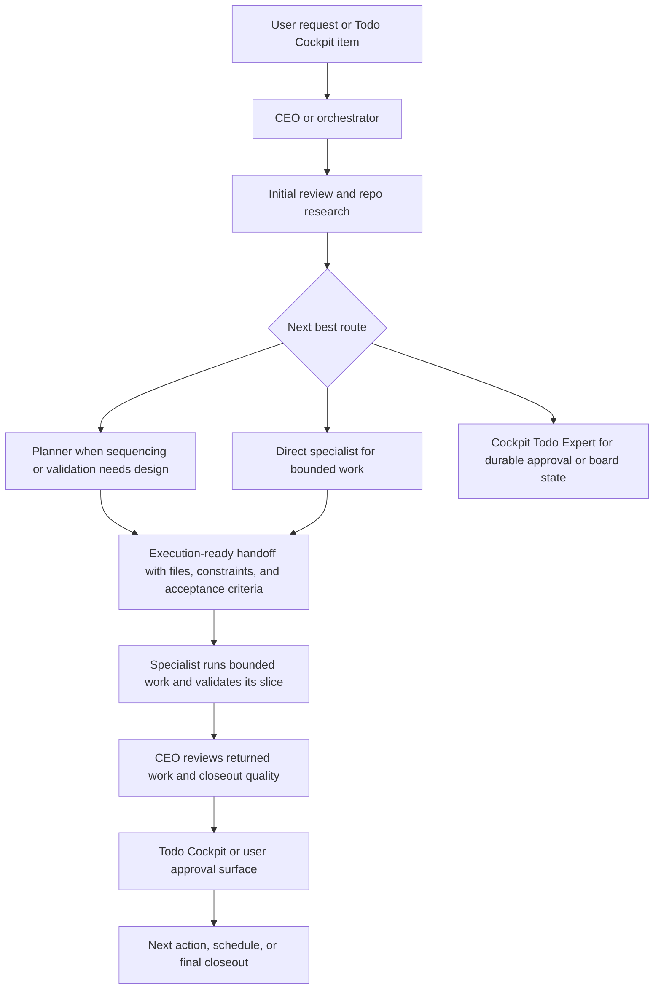

# Agent Workflow

The bundled starter agents add an optional orchestration layer for repositories that want sharper role boundaries around AI work. This layer is meant to merge into a repo, not replace an existing repo-local system.

The practical goal is simple: keep the top-level orchestrator clean, give specialists a better handoff, and return final validation through a visible approval surface instead of one bloated generalist chat loop.

## What This Layer Is For

Use the optional agent workflow when the work benefits from a clear split between orchestration and execution.

- The `CEO` or repo orchestrator interprets the request, gathers the minimum relevant repo context, chooses the route, and validates the result.
- `Planner` is used when the work still needs sequencing, scoping, or a validation design.
- Execution specialists handle bounded work in their domain and report back with the validation they ran.
- `Cockpit Todo Expert` handles durable approval state and backlog hygiene in `Todo Cockpit`.

This keeps the top layer focused on decisions instead of carrying every intermediate implementation detail. It also gives the receiving specialist a stronger starting point than an average raw prompt because the orchestrator has already done the initial framing work.

## Why It Stays Efficient

The starter-pack architecture is intentionally split into layers:

1. The orchestrator understands the real request and success condition.
2. It inventories the minimum relevant repo context: agents, skills, knowledge, and approval state.
3. It decides the next best route instead of starting execution blindly.
4. It delegates with files, constraints, and acceptance criteria.
5. The specialist runs only the bounded slice it owns.
6. Validation and closeout flow back through the orchestrator and the durable approval surface.

That structure reduces context bloat in the top-level conversation. The `CEO` does not need to carry every implementation branch, failed attempt, or local detail from every specialist loop. It stays responsible for direction, routing, and quality control, while specialists absorb the detailed execution work inside a narrower boundary.

## Operating Model

The bundled system documentation defines the following pattern:

- `CEO` is the orchestration and decision layer.
- Specialists execute within a narrow domain and return with validation.
- Shared docs under `.github/agents/system/` hold reusable process and architecture guidance.
- Repo-specific research, implementation, and testing memory lives under `.github/repo-knowledge/`.
- `Todo Cockpit` is the durable approval and backlog surface.
- Session-local tracking can exist, but long-lived approval state belongs on the board.

In practice, this means the orchestrator should do the minimum research needed to route well, then hand off a complete task packet instead of micromanaging every execution step.

## Typical Flow

1. Work starts as a user request or a `Todo Cockpit` item.
2. The orchestrator identifies the real outcome and whether the work is planning, implementation, review, backlog management, or agent-system maintenance.
3. The orchestrator checks the minimum context needed to route correctly: repo-local agents, skills, shared knowledge, and any durable approval state.
4. The orchestrator chooses the route.
5. If the path is ambiguous, `Planner` sharpens the plan and validation sequence.
6. If the work is already clear, the orchestrator routes directly to the relevant specialist.
7. The specialist executes bounded work and validates that slice.
8. The result flows back to the orchestrator for closeout review.
9. If durable approval or backlog state needs to change, that state is handled through `Todo Cockpit`.

## Better Than A Raw Prompt

The specialist should receive more than a generic instruction. A good orchestrator handoff includes:

- the goal and why it matters now
- the controlling files, systems, or abstractions
- constraints and non-goals
- acceptance criteria
- required validation
- the exact first step

This is why the optional workflow can outperform a simple one-agent loop. The specialist starts with better context because the orchestrator already did the first pass of repo research and task framing.

## Manual Sync And Ownership Boundary

Bundled-agent sync is manual by design.

- Missing bundled files can be created in `.github/agents` and `.github/repo-knowledge`.
- Previously managed files update only when the local copy still matches the last managed version.
- Customized workspace copies are skipped and reported.

That boundary matters because repo-local agent systems are user-owned. Copilot Cockpit provides a starter baseline and a sync mechanism, but it does not assume authority over a repository's existing agent architecture.

## When To Use It

The optional layer is a good fit when:

- work repeats often enough to justify a stable role split
- the repo needs cleaner handoffs between planning, implementation, documentation, and approval
- one long agent loop is becoming noisy or hard to validate
- you want a reusable orchestration baseline without forcing every repo to share the same custom agents

It is usually unnecessary for very small, one-off tasks where direct execution is already clear and low risk.

## Relationship To The Main Cockpit Workflow

This pattern sits on top of the core Copilot Cockpit surfaces rather than replacing them.

- `Todo Cockpit` remains the planning and approval surface.
- `Tasks`, `Jobs`, and `Research` remain the execution units.
- The optional agent layer improves how work is framed, delegated, and validated before or around those runs.

See [workflows.md](./workflows.md) for the core execution surfaces and [architecture-and-principles.md](./architecture-and-principles.md) for the higher-level design intent.

[Back to README](../README.md)
