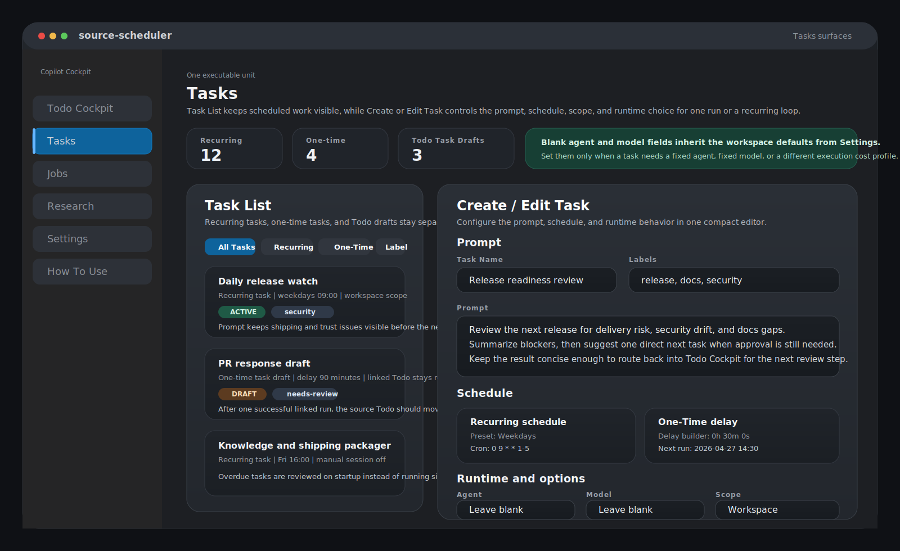
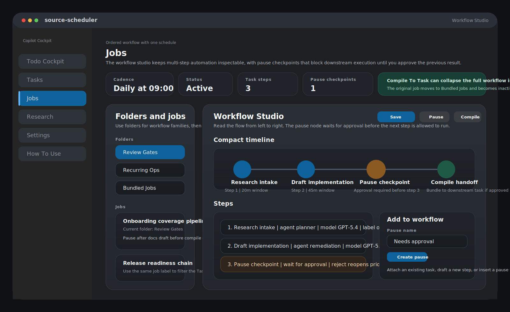
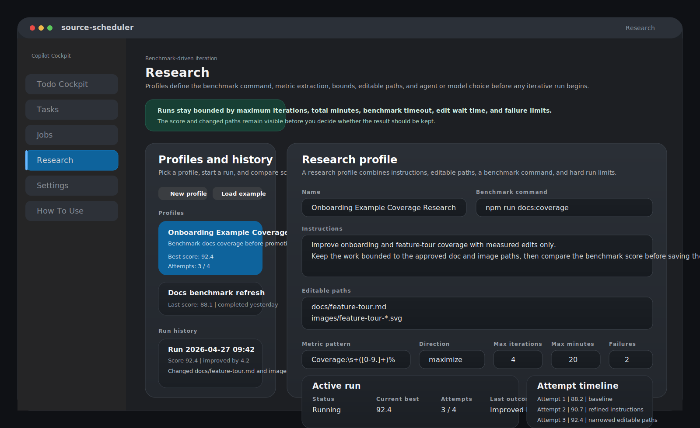
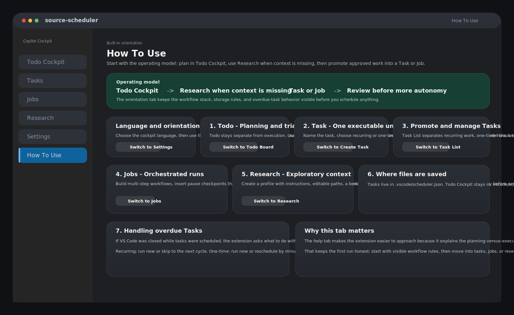

# Feature Tour

Copilot Cockpit is easiest to understand as one operating loop:

1. Plan the work.
2. Research and refine the direction.
3. Approve the handoff.
4. Run the right execution unit.
5. Review the result before granting more autonomy.

This page explains where that loop shows up in the product surface.

## Visual References

This page mixes one live demo reference with illustrative SVG mockups for the tab-specific surfaces.

- `S1` Hero overview for the top-level product identity.
- `S2` Todo Cockpit planning state.
- `S3` Task execution state.
- `S4` Job editor with pause checkpoint.
- `S5` Research profile or active run.
- `S6` Settings overview.
- `S7` How To Use onboarding tab.

Current overview reference for `S1`:

This intro video remains the current broad product overview for the docs. The tab-specific visuals below are illustrative SVG mockups for documentation, not live screenshots.

## Todo Cockpit

`Todo Cockpit` is the planning and approval hub.

Screenshot slot: `S2` for the full board surface.

Caption: Plan and review work before it runs.

- Use it to capture work before it becomes execution.
- Keep comments, labels, flags, due dates, and approval state close to the item.
- Move work into `ready` when it should hand off into execution.
- When optional GitHub integration is enabled, the top of the board also becomes a cached inbox for `Issues`, `Pull Requests`, and `Security Alerts`, with direct `Create Todo` and `Create Todo + Review` actions.

Illustrative SVG mockup of the GitHub Inbox at the top of Todo Cockpit, including cached Issues, Pull Requests, Security Alerts, and direct Todo import actions.

This is especially useful when discoveries keep showing up during normal work: bugs, feature requests, maintenance tasks, pricing checks, security findings, or follow-up ideas that should not be forgotten just because you cannot do them immediately.

Best for: work that still needs discussion, clarification, or approval.

## Tasks

`Tasks` are the simplest execution unit.

Screenshot slot: `S3`

Caption: Turn approved work into one concrete execution unit.

- Use them for one prompt and one concrete execution step.
- Schedule them once or make them recurring.
- Keep execution tied to a visible task instead of burying it in chat history.

Recurring tasks are useful for ongoing security checks, maintenance routines, competitive monitoring, idea generation, knowledge-base upkeep, or any other repeated work that should stay visible and reviewable.

In this repo, the example pack uses real recurring prompts instead of toy filler: a small-project opportunity scout, a delivery risk and security watch, and a knowledge-and-shipping packager.

Illustrative SVG mockup of the Tasks surfaces, showing the Task List alongside Create / Edit Task controls for recurring versus one-time execution, optional agent or model overrides, and workspace-default execution when those fields stay blank.

Best for: one direct action that is already ready to run.

## Jobs

`Jobs` are ordered multi-step workflows.

Screenshot slot: `S4`

Caption: Break complex automation into visible steps.

- Break complex work into reusable steps.
- Add pause checkpoints where review should happen.
- Keep the overall schedule while making the flow easier to inspect.

Jobs are the right fit when the workflow feels more like an internal automation system: staged research, implementation, maintenance, MCP tool use, or external integrations that should be paused and inspected along the way.

The included example job shows the pattern: run a few useful recurring steps, stop at a review checkpoint, and let a person decide what should become a Todo, Task, Job, or Research run next.

Illustrative SVG mockup of the Jobs workflow studio, including ordered task steps, a pause checkpoint that waits for approval, folder organization, and a visible Compile To Task handoff.

Best for: work that should not run as one opaque chain.

## Research

`Research` runs bounded benchmark-driven iteration.

Screenshot slot: `S5`

Caption: Improve against a benchmark, not by guesswork.

- Define a benchmark command and a score pattern.
- Let the system try repeated improvements against a metric.
- Stop the loop with explicit limits instead of running indefinitely.

Research can also act as a collaborative discovery phase before implementation: gather web knowledge, review the findings with the user, refine the direction, and only then turn the result into scheduled execution.

For onboarding, `Onboarding Example Coverage Research` shows the full loop in one pass: capture the gap in Todo Cockpit, use Research to benchmark the docs, promote approved fixes into Tasks or Jobs, and pause at a review checkpoint before broader autonomy.

Illustrative SVG mockup of the Research tab, showing a benchmark-driven profile with editable paths, score extraction, run limits, and an active run summary with attempts and best score.

Best for: prompt or workflow improvement that should be measured, not guessed.

## Model And Agent Choice

Copilot Cockpit assumes that different models and agents are good at different things.

- Use one model for research if it has better outside knowledge.
- Use another for implementation if it is stronger at code edits.
- Use specialized agents and skills when the repo needs domain-specific behavior instead of one general-purpose prompt.
- Use cheaper or lighter models for routine recurring work, and save more expensive models for high-value planning, review, or harder implementation tasks.

This gives the user control over both quality and cost, especially when tasks run through GitHub Copilot or OpenRouter with different available models and price points.

Best for: teams and repos that want controlled specialization instead of one general agent doing everything.

## Settings

`Settings` control workspace-level behavior.

Screenshot slot: `S6` for the full Settings overview.

Caption: Keep control at the workspace level.

- Configure repo-local defaults.
- Set up integrations such as MCP and execution preferences.
- Choose how the cockpit stores and restores its state.
- Save repo-local GitHub settings, check VS Code connection status, and refresh the cached GitHub inbox without exposing the runtime access token to the webview.

Illustrative SVG mockup of the GitHub Integration card in Settings with repo-local fields, save and refresh actions, and cached sync status.

Settings are also where the system becomes project-specific over time, because defaults, tooling, storage mode, and execution preferences can evolve with the repo instead of resetting on every session.

If you want the detailed GitHub setup and workflow, go to [GitHub Integration](./github-integration.md).

Best for: shaping how the extension behaves in the current repo.

## How To Use

`How To Use` is the built-in orientation tab.

Screenshot slot: `S7`

Caption: Start with the operating model.

- Start there if you are opening the extension for the first time.
- Use it to understand the planning versus execution model before scheduling anything.

Illustrative SVG mockup of the How To Use tab, showing the operating-model flow plus the built-in orientation sections for Todo, Tasks, Jobs, Research, storage, and overdue-task handling.

Best for: first-time users who want the operating model before the controls.

## Choosing The Right Surface

- Use `Todo Cockpit` when the work still needs planning or approval.
- Use `Tasks` when one prompt and one schedule are enough.
- Use `Jobs` when the work needs ordered stages or pause points.
- Use `Research` when the goal is measured improvement against a benchmark.

## Working Style This Enables

- Keep the human in the loop while still using AI for the heavy lifting.
- Let research happen before implementation instead of after mistakes are made.
- Run non-conflicting work in parallel while keeping risky work sequenced and visible.
- Archive completed, rejected, or reviewed work so the project gains memory over time.
- Use specialized agents, prompts, and models as a team of different experts instead of forcing one general agent to do every job.
- Control spend by matching the model and agent to the value of the task instead of sending every task to the most expensive option.

## Example Operating Loops

### Small Project Example

- Use an opportunity scout to propose the next 1 to 3 useful pieces of work.
- Use a delivery-risk and security watcher to keep shipping and trust issues visible.
- Use a knowledge packager to keep README, release notes, onboarding, and project memory current.
- Stop the loop at a review checkpoint so the owner chooses what becomes real execution.
- Add one research profile when you want to benchmark onboarding or prompt quality instead of just scheduling another task.

### Company Examples

- Product and marketing: signal triage, competitor watch, launch-asset preparation, and campaign handoff.
- Engineering and security: dependency watch, release-readiness review, migration planning, and operational-risk monitoring.
- Operations and support: SOP upkeep, ticket clustering, vendor monitoring, and recurring follow-up queues.

This is a better proof of capability than claiming the system "controls itself." It shows bounded, inspectable work that is useful on day one and still scales.

[Back to README](../README.md)
