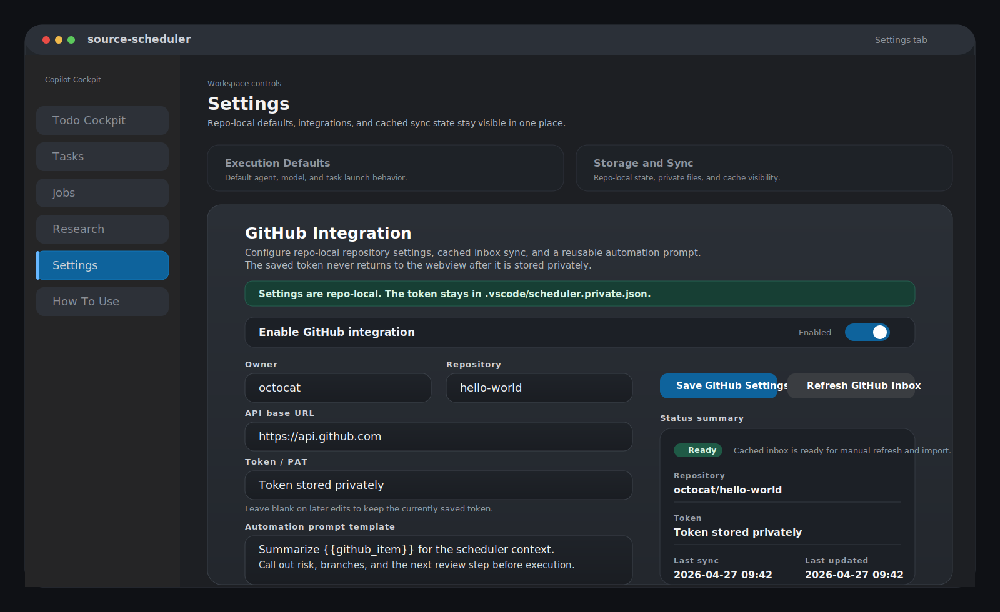
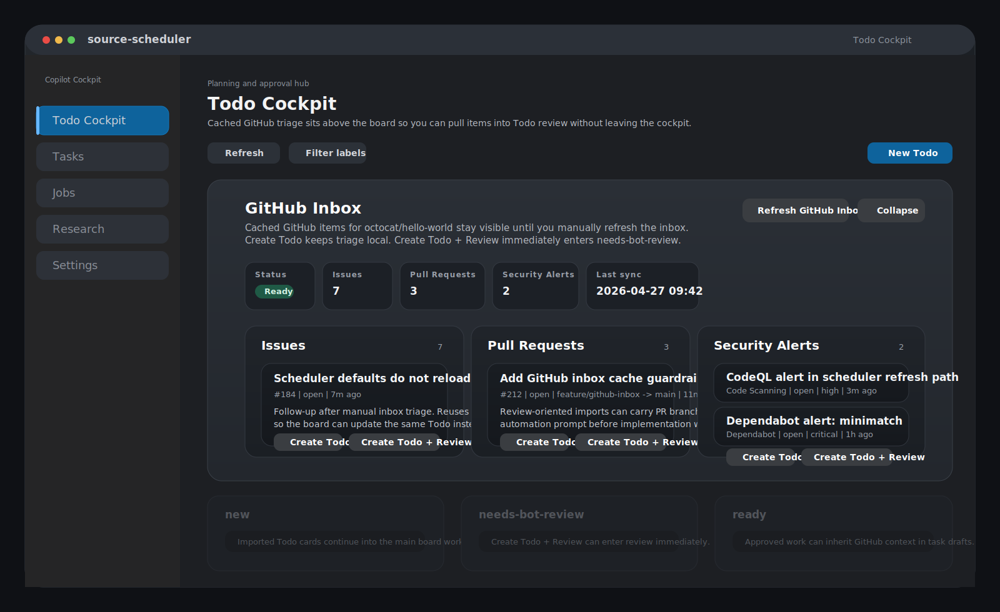

# GitHub Integration

Copilot Cockpit includes an optional repo-local GitHub integration for Todo Cockpit. It lets you save repository settings in the `Settings` tab, manually refresh a cached GitHub inbox, and turn GitHub items into Todo cards or review-oriented handoffs without exposing a runtime access token back to the webview.

This feature is intentionally narrow today:

- Inbox sync uses direct GitHub REST API reads plus repo-local cached state.
- GitHub.com refresh uses VS Code's built-in `github` authentication provider.
- Non-default GitHub API base URLs use VS Code's built-in `github-enterprise` authentication provider.
- Sync is read-only. Copilot Cockpit imports GitHub items into Todo Cockpit, but it does not mutate GitHub issues, pull requests, or alerts.
- Refresh is manual. There is no webhook or live push sync.

## What It Adds

- A `GitHub Integration` card in the `Settings` tab.
- A cached, collapsible GitHub inbox at the top of the `Todo Cockpit` board.
- Three inbox lanes: `Issues`, `Pull Requests`, and `Security Alerts`.
- Two import paths on each inbox row: `Create Todo` and `Create Todo + Review`.
- Structured GitHub source metadata on imported Todo cards so later imports reuse and update the same card instead of creating duplicates.
- GitHub-aware `needs-bot-review` and `ready` automation, including pull-request branch and security preflight.

## Enable It In Settings

Illustrative SVG mockup of the Settings tab GitHub Integration card with repo-local fields, VS Code connection status, and manual inbox refresh controls.

1. Open Copilot Cockpit and switch to the `Settings` tab.
2. Find the `GitHub Integration` section.
3. Fill in the repo-local fields for the repository you want to triage.
4. Make sure VS Code is already signed in to GitHub for GitHub.com, or to GitHub Enterprise when you use a non-default API base URL.
5. Click `Save GitHub Settings`.
6. Click `Refresh GitHub Inbox` when you want to pull the latest cached inbox data.

### Fields

| Field | What to enter |
| --- | --- |
| `Enable GitHub integration` | Turns the integration on for the current workspace. |
| `Owner` | The GitHub owner or organization, such as `octocat`. |
| `Repository` | The repository name, such as `hello-world`. |
| `API base URL` | Leave the default `https://api.github.com` for GitHub.com. Use a non-default API base URL only when you intentionally need GitHub Enterprise or another compatible endpoint. |
| `VS Code connection` | Uses your existing VS Code GitHub or GitHub Enterprise sign-in at refresh time. New saves do not store a PAT here. |
| `Automation prompt template` | Reusable GitHub-specific instructions that will be appended to GitHub-sourced `needs-bot-review` launches and `ready` task drafts. |

### GitHub Enterprise Note

When `API base URL` is not the default GitHub.com API URL, Copilot Cockpit switches refresh to VS Code's built-in `github-enterprise` authentication provider. Before requesting that session, it derives a likely server root from `apiBaseUrl` and syncs `github-enterprise.uri` at workspace scope.

That heuristic is meant to cover common GitHub Enterprise layouts such as `/api/v3`. If the configured API base URL cannot be mapped back to the correct server root, refresh stays unavailable until VS Code's GitHub Enterprise connection points at the matching server URI.

## Storage And Privacy

GitHub integration settings are repo-local.

- `.vscode/scheduler.json` and `.vscode/scheduler.private.json` can still contain legacy GitHub token fields when older workspace state is read.
- New saves no longer persist or reuse a GitHub token or PAT.
- Runtime refresh resolves credentials from VS Code's built-in authentication providers instead of workspace config.
- The webview never receives the runtime access token. It only gets safe state such as connection status, sync status, status text, timestamps, inbox counts, and cached inbox rows.
- Cached inbox rows store safe GitHub metadata such as title, URL, summary, state, severity, branch refs, and update timestamps.

For the broader storage split, see [Storage and Boundaries](./storage-and-boundaries.md).

## Refresh And Sync Status

GitHub inbox refresh is manual. Use `Refresh GitHub Inbox` when you want to pull the latest data.

The status indicator in the `Settings` tab tells you what state the integration is in:

- `Disabled`: the integration is off.
- `Needs setup`: the integration is enabled but still missing required repository fields or a matching VS Code authentication connection.
- `Ready`: setup is complete and the current inbox cache is usable.
- `Syncing`: a refresh is in progress.
- `Stale`: a refresh returned partial results and some cached data may be older than the latest manual refresh.
- `Rate-limited`: GitHub rate limiting blocked part or all of the refresh. Cached data is shown where available.
- `Error`: the refresh failed before the integration had usable data.

The view also exposes `Last sync` and `Last updated` timestamps so you can tell whether the cache is current enough for the next triage pass.

If a refresh partially fails after an earlier successful sync, Copilot Cockpit keeps previously cached successful lanes where it can instead of wiping the board inbox.

## Board Inbox

Once configured, `Todo Cockpit` shows a cached GitHub inbox at the top of the board.

Illustrative SVG mockup of the Todo Cockpit GitHub Inbox with cached Issues, Pull Requests, Security Alerts, and local import actions.

- The inbox is collapsible.
- Each lane is collapsible.
- `Issues` shows open issues only.
- `Pull Requests` shows open pull requests, including draft state and branch refs when GitHub returns them.
- `Security Alerts` combines the supported security alert lanes currently implemented by the extension: code scanning alerts and Dependabot alerts.

This inbox is a triage surface, not a live mirror. It updates when you explicitly refresh it, then keeps the cached rows in repo-local state for later board sessions.

## Import Paths

Each GitHub inbox row exposes two local import actions:

- `Create Todo`: creates or updates a normal Todo card for manual triage.
- `Create Todo + Review`: creates or reuses the Todo card, moves it into `needs-bot-review`, and immediately starts the review-oriented automation path.

Imported cards persist structured `githubSource` metadata. That means duplicate imports do not create a second card for the same GitHub item.

When you import the same item again, Copilot Cockpit reuses the existing Todo when it can match the GitHub source by item ID, URL, or kind and number inside the same repository context. If the incoming GitHub data is newer or more complete, the existing card is updated in place.

In practice that means repeated imports can refresh the card title, description, priority, flags, labels, and GitHub source details instead of fragmenting the board into duplicates.

## GitHub-Aware Automation

GitHub-sourced Todo automation now uses the saved GitHub prompt text instead of merely storing it.

### `needs-bot-review`

When a GitHub-sourced Todo enters `needs-bot-review`, the launched review prompt can include:

- The normal Todo context.
- GitHub context such as repository, item kind, number, URL, state, severity, and branch refs.
- The saved GitHub automation prompt as an explicit GitHub-specific instruction block.
- Pull-request branch and security preflight when the source item is a pull request.

### Pull Request Security-First Preflight

For pull-request sourced handoffs, Copilot Cockpit adds a dedicated preflight block before implementation work:

- It tells the agent that security review comes before implementation.
- It includes the required PR head branch when GitHub returned it.
- It asks for the current local branch.
- When VS Code's built-in Git extension can provide the current branch, that branch name is included in the prompt.
- If the current branch is unavailable or does not match the PR head branch, the prompt tells the agent to stop before implementation and surface that mismatch.

This is a prompt-side guardrail, not a forced checkout. Copilot Cockpit does not switch branches for you.

### `ready` Task Drafts

The same GitHub context is not limited to the immediate review launch.

When a GitHub-sourced Todo later moves to `ready` and Copilot Cockpit creates or reopens its task draft, the generated `ready` prompt also carries:

- GitHub context.
- The saved GitHub automation prompt.
- Pull-request branch and security preflight.

That keeps the downstream task draft aligned with the earlier GitHub-aware review path instead of dropping the source context at handoff time.

## Current Limits

- This is not a deep integration with the GitHub Pull Requests and Issues extension.
- Inbox sync is GitHub REST plus repo-local cached state.
- The sync path is read-only.
- Refresh is manual.
- There is no webhook or live push sync.
- GitHub Enterprise refresh depends on VS Code's `github-enterprise` provider and a server URI that can be derived from the configured `apiBaseUrl` or is already configured in VS Code.

## Recommended Operator Workflow

1. Configure the repo-local GitHub settings in `Settings` and save them.
2. Make sure the matching VS Code GitHub or GitHub Enterprise connection is already available.
3. Refresh the inbox when you want current GitHub items.
4. Use `Create Todo` for normal backlog intake or `Create Todo + Review` when the item should immediately enter `needs-bot-review`.
5. Review and refine the Todo card in `Todo Cockpit`.
6. Move approved work to `ready` so the linked task draft inherits the GitHub context and any PR preflight guidance.

[Back to Docs Index](./index.md)